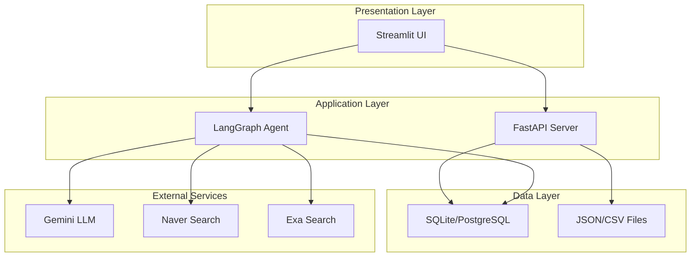
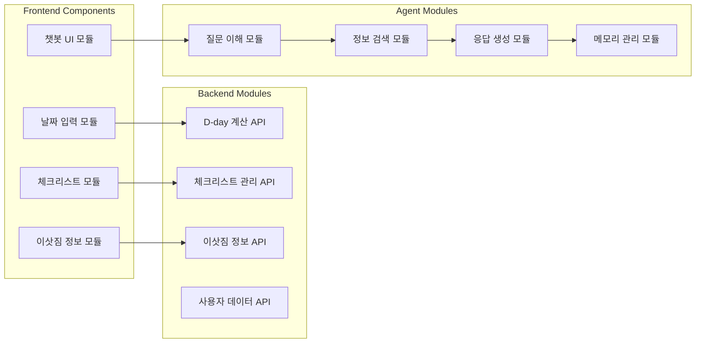
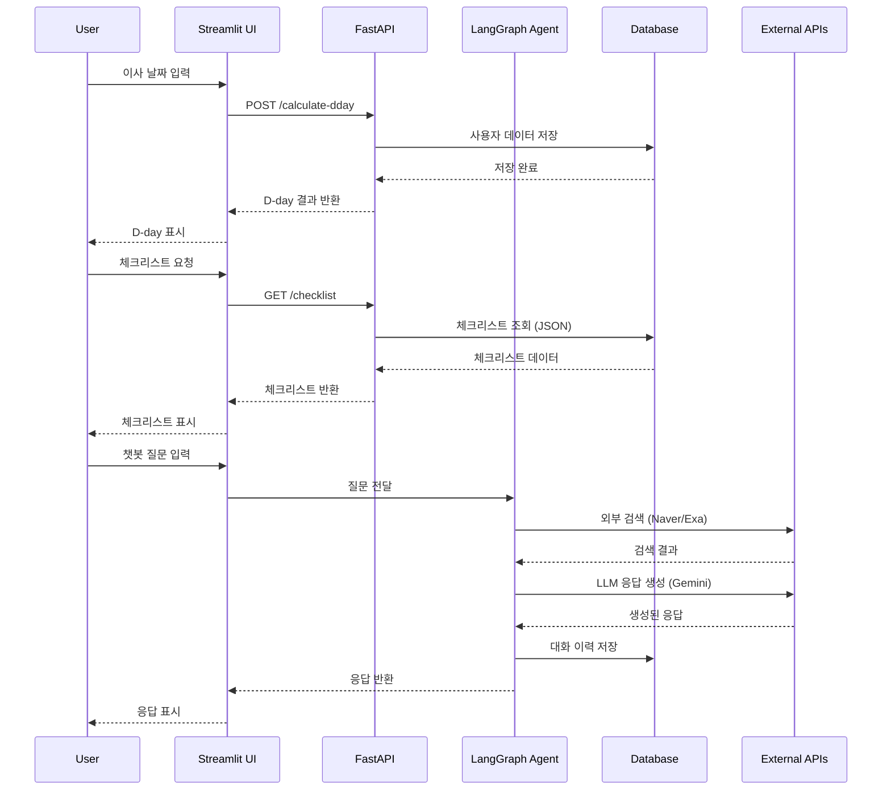
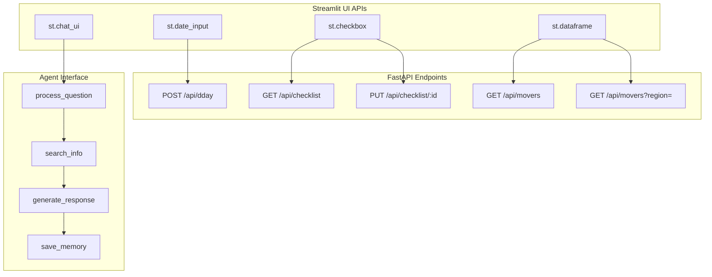
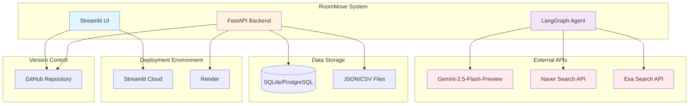

# RoomMove 시스템 아키텍처

## 아키텍처 구성요소
- **Frontend Layer:** Streamlit UI
- **Backend Layer:** FastAPI Server
- **Agent Layer:** LangGraph Agent System
- **Data Layer:** SQLite/PostgreSQL, JSON/CSV
- **External Services:** Naver Search API, Exa Search API, Gemini LLM API

## 계층 구조

## 모듈화 및 컴포넌트

## 데이터 흐름

## API 및 인터페이스

## 시스템 외부 환경과의 관계

