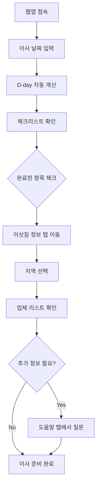

# RoomMove 사용자 시나리오

## 페르소나
- **이름**: 김민지 (27세, 여성)
- **직업**: IT 스타트업 마케터
- **거주형태**: 1인 가구 (원룸 → 오피스텔 이사 예정)
- **특징**: 정보 탐색은 잘하지만 행정·일정 관리에 약함, 이사 경험 1회

## 정황
- 회사 근처로 이사를 결심하고 2주 후 이사 날짜 확정
- 해야 할 일이 많지만 순서나 시점이 헷갈림 (전입신고, 인터넷 해지, 이삿짐 예약 등)
- 이삿짐 센터를 어디서 찾아야 할지, 가격은 얼마인지 비교가 어려움
- 일정, 체크리스트, 문서가 카카오톡, 메모앱, 네이버에 흩어져 있어 관리가 번거로움

## 사용자의 목표
- 이사 준비 과정을 한곳에서 체계적으로 관리하고 싶음
- 놓치면 안 되는 필수 To-Do를 자동으로 확인하고 싶음
- 지역별 이삿짐 센터 정보를 빠르게 비교하고 싶음

## 사용자의 작업 및 행동
1. RoomMove 웹앱 접속
2. 사이드바에서 이사 날짜 입력 (예: 2025-11-16)
3. 메인 화면에서 D-day 자동 계산 결과 확인 (D-14)
4. 체크리스트 탭에서 자동 생성된 To-Do 리스트 확인
   - 전입신고 (이사 후 14일 이내)
   - 공공요금 해지/신규
   - 인터넷/TV 계약 변경
   - 청소 및 정리
5. 완료한 항목은 체크박스로 표시
6. 이삿짐 정보 탭에서 지역 선택 (예: 서울 강남구)
7. 해당 지역 이삿짐 센터 리스트 확인 (업체명, 연락처, 예상 금액)
8. 필요시 도움말 탭에서 "전입신고 언제 해요?" 같은 질문 입력

## 시나리오

## 기대효과 또는 결과
- 이사 준비 과정을 한 화면에서 관리하여 정보 탐색 시간 50% 단축
- 자동 체크리스트로 필수 행정 절차 누락 방지
- 지역별 이삿짐 센터 정보를 빠르게 비교하여 예약 결정 시간 단축
- 일정 관리 스트레스 감소 및 이사 준비 만족도 향상
